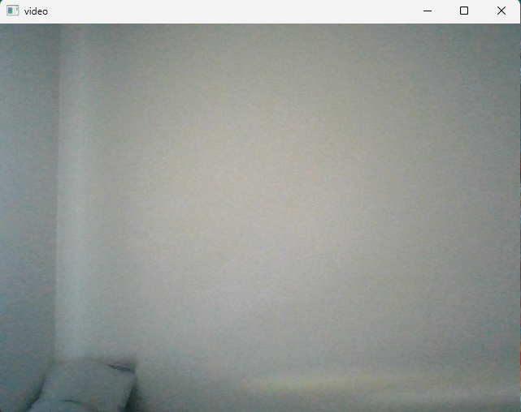
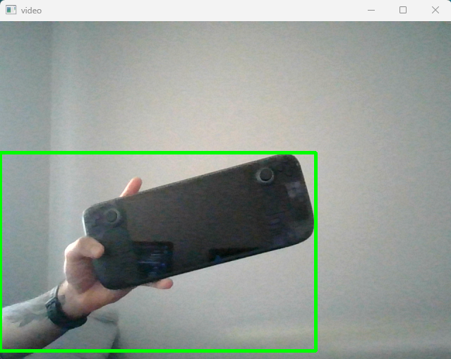
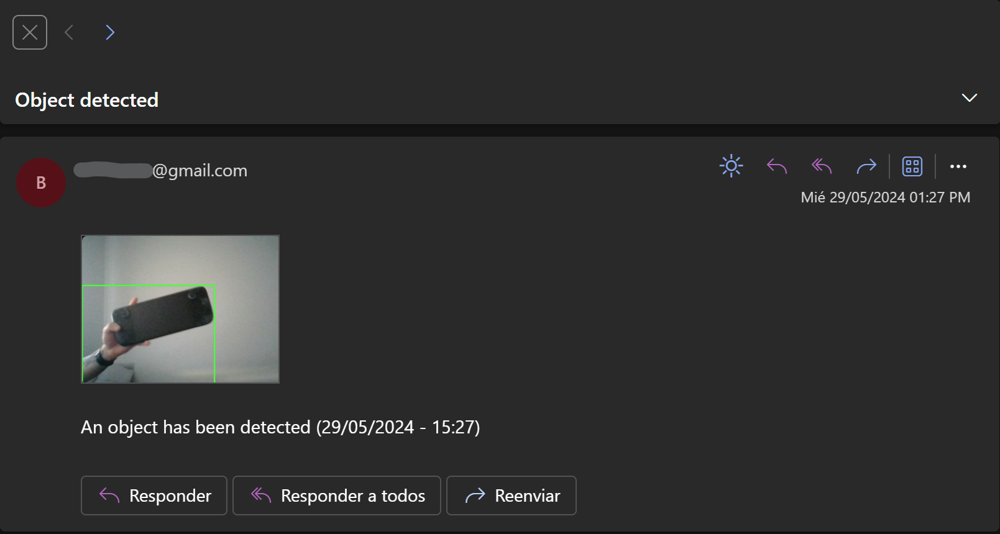

# Webcam monitoring app with email alert

This project uses live webcam video to identify items that weren't in the initial frame; in other words, it uses the first frame captured by the camera as a point of reference to identify other objects.

By subtracting the current frame from the initial frame, the opencv library is able to detect new objects and perform various frame changes. An object will be identified as soon as it enters the frame, and a bounding box will be drawn around it to follow it until it exits the screen. When the object leaves the frame, the program will send an email with an image of the object as an attachment.

After the object leaves the frame, the program will continue execution, repeating the same pattern of detecting objects and sending an email when the object leaves.

### How to use?

* Install requirements.txt
* Create a *.env* file in the root directory of the project and set the following variables:
  * *sender:* Gmail address which will serve as the sender
  * *receiver:* Email address which will receive the alert (doesn't need to be a gmail accoount)
  * *password: Gmail app password*
* Simply run main.py

### Screenshots

* Reference frame (ignore the pillow xd)

  
* Object detection

  
* E-mail alert

  
